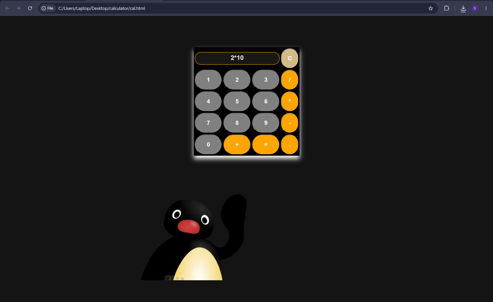

🧮 A simple calculator that performs basic arithmetic operations such as ➕addition, ➖substraction, ➗division, ✖️multiplication.
- The calculator is developed using HTML, CSS, JavaScript.
- Clear/reset functionality.
- Handles decimal numbers.

## A calculator that perform ✖️ ➗ ➖ ➕

### Calculator view

